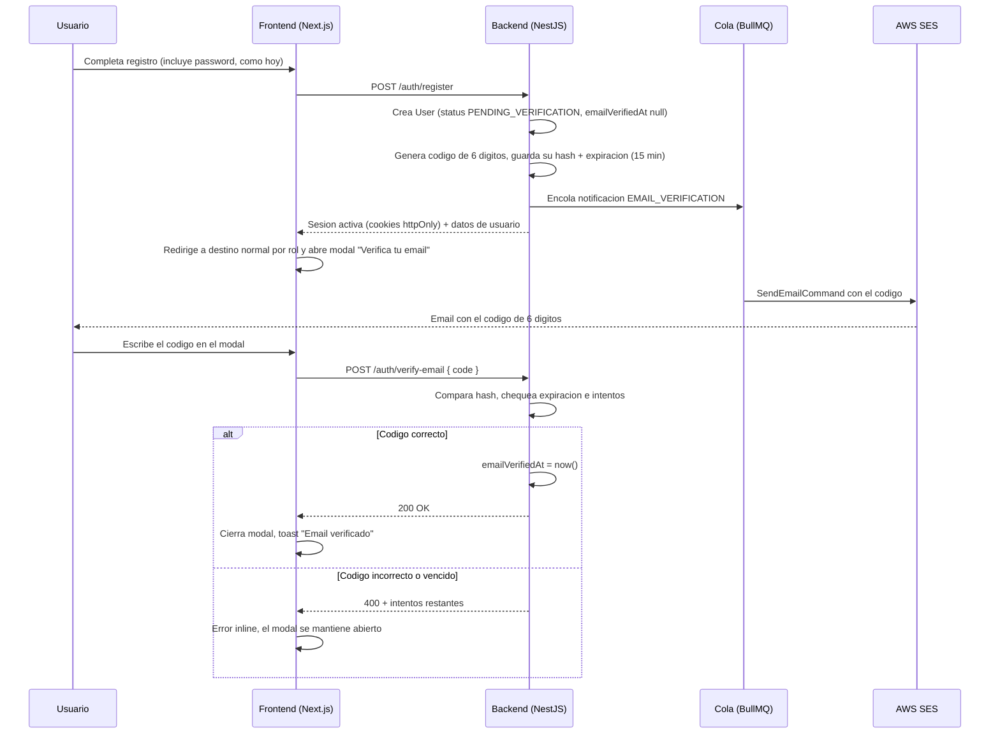
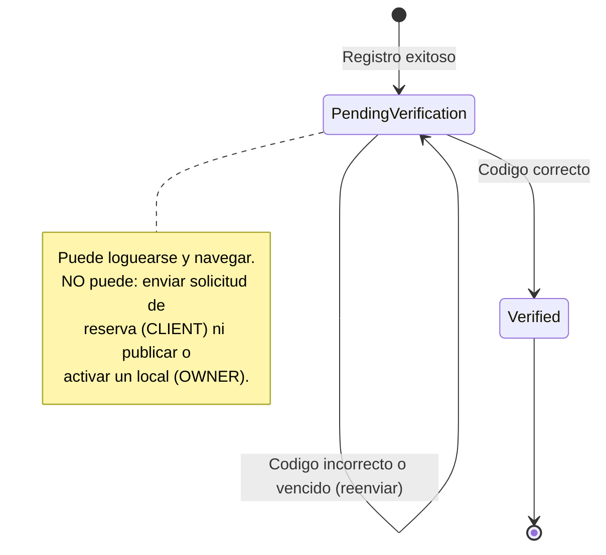

# Auth improvements: OAuth (Google + extensible), post-login redirects, existing-email handling, and email verification

Análisis de las cuatro piezas que se pidieron, basado en como funciona el auth de SalonFacil hoy
(no en una implementación genérica desde cero). Cada sección dice qué hay ahora, qué falta, y cuál
es la recomendación con su porqué. Es un documento de análisis — ninguno de los cambios que
describe está implementado todavía.

## 0. Cómo funciona el auth hoy (la base sobre la que se construye todo esto)

Vale la pena dejarlo escrito porque las cuatro secciones siguientes reusan piezas de esto en vez de
inventar mecanismos nuevos:

- **Sesión**: `AuthService.login/register` emite un access + refresh token (`TokenService`) y el
  controller los escribe como cookies `httpOnly` vía `setAuthCookies` (`auth-cookies.util.ts`) — el
  JSON de respuesta nunca lleva los tokens (`toPublicResponse` los saca a propósito). El frontend
  nunca toca el token directamente; `useAuthStore` (Zustand) solo guarda `user`/`role`/
  `isAuthenticated` para que la UI sepa qué mostrar mientras la cookie real decide todo.
- **Redirección post-login ya existe, parcialmente**: `LoginForm` (`components/auth/login-form.tsx`)
  ya lee un query param `?next=` de la URL, valida que sea una ruta interna segura (`startsWith('/')`,
  no `//`) y que un CLIENT no pueda usarlo para colarse a `/dashboard`, y si no hay `next` usable cae
  a un default por rol: `OWNER → /dashboard`, cualquier otro caso → `/bookings`. **ADMIN no tiene rama
  propia** — cae en el mismo default que CLIENT, lo cual es un bug menor que esta misma tarea debería
  corregir de paso.
- **El flujo de "volver a donde estaba" para reservas ya está resuelto, y mejor de lo que un
  `next=` podría lograr**: `LoginToBookModal` no navega a ningún lado — abre el login en un modal
  *sobre* la página de detalle del local, y en `onSuccess` simplemente cierra el modal
  (`onOpenChange(false)`). La página de atrás nunca se movió, así que el formulario de reserva sigue
  exactamente como el usuario lo dejó. Esto es mejor que cualquier `next=` porque no hay
  ida-y-vuelta de página. **Pero este truco no le sirve a OAuth** (ver §2) porque OAuth necesita salir
  del dominio hacia Google y volver — no se puede hacer "en un modal sin navegar".
- **El rol se fija por punto de entrada, no lo elige el usuario**: `/register` siempre pasa
  `role="CLIENT"` a `RegisterForm`; el registro de propietarios (`role="OWNER"`) es otro punto de
  entrada. El comentario en `register-form.tsx` lo dice explícito: "the role picker was confusing for
  clients, so each entry point is fixed". Esto importa para Google: un botón "Continuar con Google" en
  la página de registro de clientes tiene que crear un CLIENT, y el de propietarios un OWNER, sin
  preguntarle nada al usuario.
- **La verificación existe en el modelo de datos pero no está conectada a nada**: `User` ya tiene
  `emailVerifiedAt`/`phoneVerifiedAt` (nullable) y `status` default `PENDING_VERIFICATION` en el
  schema — pero `UserRepository.create()` fuerza `status: UserStatus.ACTIVE` al crear la cuenta
  (`auth.repository.ts:42`) y nunca setea `emailVerifiedAt`. Como `UserEntity.isActive()` compara
  contra `status === ACTIVE` (no contra `isVerified()`), hoy **cualquier email pasa, sin verificación
  de ningún tipo** — es exactamente lo que describiste. La buena noticia es que no hay que diseñar
  campos nuevos para esto, ya están; falta la lógica que los use.
- **Ya existe un patrón de token-por-email para copiar**: `PasswordResetToken` (modelo Prisma +
  `ForgotPasswordDto`/`ResetPasswordDto` + `AuthService.forgotPassword/resetPassword`) es exactamente
  la forma "generar token → hashearlo → guardarlo con expiración → mandarlo por link → validarlo →
  marcarlo usado" que la verificación de email necesita. Reusar esa forma en vez de inventar una
  nueva mantiene el código consistente y reduce lo que hay que escribir.

---

## 1. Login con Google, diseñado para no ser el último proveedor

### Qué falta hoy

Nada está armado: `passport-jwt` y `passport-local` están instalados, pero no `passport-google-oauth20`
ni ninguna variante. No hay `GOOGLE_CLIENT_ID`/`GOOGLE_CLIENT_SECRET` en
`config/validation.schema.ts`. El modelo `User` no tiene forma de vincularse a una identidad externa.
Y dos columnas de `User` son obligatorias y Google no las provee:

```prisma
phone           String     @unique   // Google no manda telefono
passwordHash    String                // Google no manda password
```

### La decisión de diseño que importa: dónde vive el "esto es una cuenta de Google"

**Opción A — columnas en `User`** (`googleId String? @unique`, después `facebookId String? @unique`,
etc.): simple al principio, pero cada proveedor nuevo es una migración + una columna que solo se usa
para ese proveedor. No escala bien a "otros" como pediste.

**Opción B — tabla de identidades externas, un solo modelo para todos los proveedores**
(recomendada — es el patrón que usan Auth.js/NextAuth, Supabase Auth y Firebase Auth internamente):

```prisma
model UserIdentity {
  id         String   @id @default(uuid())
  userId     String   @map("user_id")
  provider   String   // "google" | "facebook" | ...
  providerId String   @map("provider_id") // el "sub" que manda el proveedor
  email      String?  // el email que reporto el proveedor en ese momento
  createdAt  DateTime @default(now()) @map("created_at")

  user User @relation(fields: [userId], references: [id], onDelete: Cascade)

  @@unique([provider, providerId])
  @@index([userId])
  @@map("user_identities")
}
```

Agregar Facebook mañana es una fila en una tabla de estrategias, no una migración de `User`. Y
`@@unique([provider, providerId])` es la protección real: nunca dos cuentas locales distintas pueden
reclamar el mismo `sub` de Google.

### Los dos campos obligatorios que Google no llena

- `passwordHash`: hacerlo `String?` (nullable). Una cuenta que solo tiene identidades OAuth
  simplemente no tiene contraseña — y el login por password (`AuthService.login`) ya debería rechazar
  con un mensaje claro ("esta cuenta usa Google para iniciar sesión") en vez de comparar contra un
  hash que no existe.
- `phone`: Bolivia + WhatsApp (Twilio) dependen de este dato, y Google no lo tiene. No lo hagas
  opcional en el schema — mejor una pantalla obligatoria post-Google **"completa tu perfil"** que pide
  el teléfono boliviano (mismo regex que ya usa `register.dto.ts`) antes de dejar pasar al usuario a
  cualquier otro lado. Este mismo paso es donde se resolvería más adelante la verificación de
  teléfono si algún día la agregan (ver nota al final de §4).

### Arquitectura del lado del servidor

NestJS + Passport ya está en el proyecto, así que el patrón natural es una `GoogleStrategy`
(`passport-google-oauth20`) al lado de la `JwtStrategy` existente, con dos rutas nuevas en
`auth.controller.ts`:

- `GET /auth/google` — redirige a Google (`AuthGuard('google')`).
- `GET /auth/google/callback` — Google vuelve acá con el perfil ya verificado. Este handler:
  1. Busca `UserIdentity` por `(provider: 'google', providerId: profile.sub)`.
  2. Si existe → es un login, listo (ver §3 si en cambio el email ya existía sin `UserIdentity`).
  3. Si no existe → crea `User` (con el `role` que venga en `state`, ver §2) + su `UserIdentity`,
     dispara la notificación de bienvenida (ya existe ese patrón en `AuthService.register`).
  4. Llama al mismo `issueTokens`/`setAuthCookies` que ya usan login y register — la sesión que
     resulta es indistinguible de una sesión por password, todo lo demás en el frontend sigue
     funcionando sin tocarlo.
  5. Redirige al frontend según el `state` decodificado (§2).

### Frontend

Un botón "Continuar con Google" en `/login`, `/register` y el registro de propietarios que simplemente
navega a `${API_URL}/auth/google?state=...` (no es una llamada `fetch` — es una navegación real de
página completa, porque OAuth necesita salir del dominio). El armado de `state` se explica en §2.

### Costo real

No es un toggle: una migración (`UserIdentity` + `passwordHash` nullable), una `GoogleStrategy` +
2 rutas en el backend, 3 botones + la pantalla "completa tu teléfono" en el frontend, y las decisiones
de §2/§3 resueltas antes de que el callback pueda redirigir bien. Diseñado así, agregar Facebook
después es solo una `FacebookStrategy` + un botón — nada de esto se vuelve a tocar.

---

## 2. A dónde redirigir después de loguearse — unificando lo que ya existe con lo que OAuth necesita

### El problema que OAuth introduce

El truco de `LoginToBookModal` (nunca navegar, solo cerrar el modal) no funciona para Google, porque
el navegador tiene que salir físicamente hacia `accounts.google.com` y volver — la página de origen
se pierde. Así que para el caso de "Google desde el modal de reserva" hace falta el mismo mecanismo
que ya existe para el `/login` standalone: guardar a dónde volver, mandarlo a través del viaje, y
usarlo al volver.

### Cómo llevar el "volver a" a través del viaje a Google

El parámetro `state` de OAuth 2.0 existe exactamente para esto (y además protege contra CSRF si se
firma). Antes de redirigir a Google, el backend arma:

```json
{ "next": "/venues/salon-imperial-villa-adela", "intent": "CLIENT", "nonce": "..." }
```

...lo firma (HMAC con un secreto del backend, para que el callback pueda confiar en él sin ida y
vuelta a una base de datos) y lo manda como `state`. Google lo devuelve intacto en el callback. El
backend lo verifica y lo usa para:

- **`next`**: la URL a la que había que volver — la misma idea que ya vive en `?next=` de
  `login-form.tsx`, solo que ahora viaja dentro de `state` en vez de la query string del `/login`
  interno.
- **`intent`**: qué `role` corresponde si termina siendo un registro nuevo — viene del botón que se
  apretó (`/register` manda `CLIENT`, el registro de propietarios manda `OWNER`), replicando el
  "el rol lo fija el punto de entrada" que ya usa `RegisterForm`.

### Unificando los defaults (y arreglando el hueco de ADMIN)

`LoginForm` ya tiene la lógica correcta, solo le falta la rama de ADMIN. La recomendación es
literalmente completar la tabla que ya existe, y que tanto el login normal como el callback de Google
usen la misma función:

| Rol | Sin `next` usable | Justificación |
|---|---|---|
| CLIENT | `/bookings` | "mis reservas" — así ya es hoy |
| OWNER | `/dashboard` | así ya es hoy |
| **ADMIN** | **`/admin`** | **hoy cae en el default de CLIENT — hay que arreglarlo** |

Y el caso que motivó todo esto — "por ahí está por hacer la solicitud de reserva" — ya funciona sola
con este diseño: si el usuario clickeó "Continuar con Google" desde dentro de `LoginToBookModal`, el
`next` que se firma es la URL del local donde estaba parado, y el callback lo manda de vuelta ahí con
la sesión ya activa — el formulario de reserva se re-hidrata con los datos que haya guardado
localmente (o el usuario los vuelve a tipear una vez, que es la única degradación real de UX frente
al modal-sin-navegar; inevitable en cualquier OAuth redirect-based).

---

## 3. Si el email ya existe (registro normal) y después intenta entrar con Google

Este es el escenario con más superficie para decisiones equivocadas, así que vale la pena separarlo
en los tres casos reales:

### Caso A — el email ya tiene cuenta con contraseña, y ahora usa "Continuar con Google" con ese mismo email

**Recomendación: vincular automáticamente**, no rechazar ni crear una cuenta duplicada (que además el
`@unique` en `email` no dejaría hacer sin manejarlo explícito — hoy terminaría en un 500 de
constraint violation si no se atiende).

¿Por qué es seguro vincular automático? Porque el ID token que devuelve Google incluye
`email_verified: true` — Google ya probó que esa persona controla esa casilla de correo. Es, de
hecho, una prueba de identidad **más fuerte** que la que tiene hoy el registro por password (que,
como viste en §0, no verifica nada). Es el mismo criterio que usan la gran mayoría de sistemas con
login social (GitHub, Reddit, la mayoría de SaaS): si el proveedor externo confirma el email y
coincide con una cuenta local existente, se asume que es la misma persona y se crea la
`UserIdentity` apuntando a ese `User` ya existente — sin pedir la contraseña vieja, porque ya se
probó identidad por otra vía.

Al volver, un toast como *"Tu cuenta ya existía y ahora también podés entrar con Google"* evita
confusión — sobre todo la primera vez.

Nota de seguridad: esto **solo** es seguro si el proveedor realmente confirma
`email_verified: true`. Google siempre lo hace para cuentas @gmail y para Workspace verificado; si
en el futuro agregan un proveedor que no lo confirme, ese proveedor específico no debería
auto-vincular sin un paso extra de confirmación.

### Caso B — la cuenta ya es de Google (tiene `UserIdentity`), e intenta "olvidé mi contraseña" o loguearse con password

Como `passwordHash` quedó `null`, el login por password debe fallar con un mensaje específico
("Esta cuenta usa Google para iniciar sesión — usá el botón de Google") en vez del genérico
"credenciales inválidas" — mejor UX, y no revela si el email existe (mismo cuidado anti-enumeración
que ya tiene `forgotPassword` hoy).

### Caso C — ninguna cuenta existe con ese email

El caso simple: se crea `User` + `UserIdentity` en el mismo paso que describe §1, con el `role` que
venga de `intent` en `state`.

---

## 4. Verificación de email en el registro — código + modal vs. link, y por qué código

Decisión ya tomada en la conversación: **no se verifica teléfono/WhatsApp** (tiene costo por Twilio),
solo email — pero el email sí tiene que ser real, porque de él dependen las notificaciones de
reserva, el reset de contraseña, y más adelante campañas. Confirmado además que hoy
`register.dto.ts` solo valida formato (`@IsEmail()`); `test@test.com` pasa sin problema porque nadie
chequea si la casilla existe de verdad.

### Las dos opciones que se plantearon

**Opción A — "link para setear tu password"**: el registro no pide contraseña; se manda un link por
email, y al clickearlo el usuario recién ahí define su contraseña (eso prueba que controla el email).

**Opción B — código de 6 dígitos + modal en la misma pestaña**: el registro se mantiene igual que
hoy (contraseña incluida), y justo después de crear la cuenta se abre un modal en el sitio pidiendo
un código que se manda por email.

### Por qué Opción B es la recomendada para este caso

No es solo preferencia — hay una razón concreta de UX que pesa mucho para un producto usado
mayormente desde el celular en Bolivia:

- **Opción A obliga a cambiar de contexto, y a veces de dispositivo.** El usuario llena el
  formulario, se va a la app de correo (a veces en OTRO dispositivo si registró desde la compu y
  revisa el correo en el celular), clickea el link, termina el registro ahí — y si empezó en la
  compu, tiene que volver a esa pestaña y loguearse de nuevo. Es un patrón conocido de abandono.
- **Opción B nunca hace salir al usuario de la pestaña donde ya está.** Solo necesita *mirar* el
  código en el correo (celular o compu, da igual) y volver a tipear 6 dígitos en la misma pantalla
  donde ya estaba. Mucho menos fricción real, aunque en el papel "clickear un link" suene más simple.
- **Opción B es un cambio aditivo — cero riesgo al formulario que ya funciona.** El
  `RegisterForm` actual (`components/auth/register-form.tsx`) no se toca: sigue pidiendo contraseña
  igual que hoy. Solo se agrega un paso *después* de `onSuccess`. Opción A en cambio significa sacar
  el campo contraseña del formulario y construir una pantalla nueva de "definí tu contraseña" — más
  superficie de cambio para el mismo resultado.
- **Opción A tiene un estado "cuenta a medias" más feo de manejar**: si el usuario nunca clickea el
  link, no tiene contraseña, no puede loguearse, y necesita su propio flujo de "reenviar link de
  activación" separado del de reset-password. Opción B no tiene ese problema: la cuenta ya tiene
  contraseña desde el minuto uno, "pendiente de verificar" es solo una bandera adicional, no un
  bloqueo para loguearse.

**Recomendación: Opción B.**

### El flujo recomendado



Notas del diagrama:

- La sesión se abre **antes** de verificar (mismo criterio híbrido de siempre: dejar entrar, exigir
  verificación solo en las acciones que importan). El modal es un overlay sobre la página a la que ya
  redirigió — no es una pantalla bloqueante previa al login.
- El modal se puede cerrar sin verificar ("Verificar más tarde"); si se cierra, un banner discreto se
  mantiene hasta que el usuario verifique, con un botón para reabrir el modal cuando quiera.
- El código es de un solo uso y expira en 15 minutos — tiempo suficiente para revisar el correo sin
  dejar la ventana de ataque abierta mucho tiempo.

### El estado de la cuenta a lo largo del tiempo



### El caso que hay que resolver bien: refrescar la página, o darle "atrás", con el modal abierto

Si el modal solo se abre como reacción puntual a `onSuccess` del `useMutation` de registro (un
`useState` local que se prende una vez), un F5 o un back del navegador lo hace desaparecer para
siempre — aunque la cuenta siga exactamente igual de `PENDING_VERIFICATION` en el servidor. El
usuario se queda sin manera obvia de volver a ver el modal, y probablemente piensa que ya quedó
verificado.

La causa raíz es tratar "recién me registré" como la fuente de verdad de si hay que mostrar el
modal. Hay que invertirlo: la fuente de verdad tiene que ser el propio estado de la cuenta, no un
evento de navegación efímero.

**El arreglo, en dos partes:**

1. **Exponer `emailVerified` en el objeto de sesión.** Hoy `toPublicResponse`/`toProfileDto`
   (`auth.controller.ts`) arman el `user` que se guarda en `useAuthStore` con `id`, `email`, `phone`,
   `fullName`, `role`, `status`, etc. — pero no incluyen `emailVerifiedAt`. Hay que agregarlo (como
   booleano `emailVerified`, no hace falta exponer el timestamp exacto) tanto en la respuesta de
   `/auth/register` y `/auth/login` como en el endpoint que ya usan para rehidratar el perfil al
   cargar la app. Así, ese dato viaja con la sesión sin importar si la página se cargó por primera
   vez, se refrescó, o el usuario volvió tres días después.

2. **Mover el banner/modal de "evento único" a "derivado del estado en cada render".** En vez de que
   el modal dependa de haber pasado por `onSuccess` de registro, un componente a nivel de layout (por
   ejemplo dentro de `SiteHeader`, que ya se renderiza en toda página pública) chequea en cada render:
   `isAuthenticated && user && !user.emailVerified`. Si es cierto, muestra el banner discreto — no
   hace falta que haya "recién registrado" en la sesión del navegador para que aparezca. El modal en
   sí sigue siendo el mismo componente; lo único que cambia es *quién decide abrirlo*.

Con esto, F5, "atrás", cerrar y volver a abrir la pestaña, o directamente loguearse *mañana* con una
cuenta todavía sin verificar — los cuatro casos terminan mostrando el mismo banner, con el mismo
botón para reabrir el modal, porque ninguno depende de por dónde navegó el usuario. El modal que se
abre automáticamente apenas termina el registro sigue siendo un lindo primer empujón (evita que el
usuario tenga que darse cuenta solo), pero deja de ser el *único* mecanismo — es una conveniencia
sobre el banner, no un reemplazo.

Un detalle chico pero real: si el usuario reabre el modal y ya pasaron los 15 minutos, tiene que ver
"tu código expiró, pedí uno nuevo" en vez de un input vacío esperando un código que ya está muerto —
el botón de reenvío que ya estaba planeado cubre esto sin necesitar nada adicional.

### Por qué un código sí necesita reglas que un link no necesita

Un link con un token largo (como ya hace `PasswordResetToken`) es imposible de adivinar por fuerza
bruta. Un código de 6 dígitos tiene solo 1,000,000 de combinaciones — manejable para un bot si no se
limita. Por eso el modelo nuevo necesita más que `PasswordResetToken`:

```prisma
model EmailVerificationCode {
  id        String    @id @default(uuid())
  userId    String    @map("user_id")
  codeHash  String    @map("code_hash")
  attempts  Int       @default(0)
  expiresAt DateTime  @map("expires_at")
  usedAt    DateTime? @map("used_at")
  createdAt DateTime  @default(now()) @map("created_at")

  user User @relation(fields: [userId], references: [id], onDelete: Cascade)

  @@index([userId])
  @@map("email_verification_codes")
}
```

Reglas concretas a aplicar en `AuthService`:

- Máximo 5 intentos por código — al superarlo, ese código queda inválido aunque no haya expirado
  (fuerza a pedir uno nuevo, no a seguir probando).
- Reenviar invalida el código anterior y genera uno nuevo (nunca dos códigos válidos al mismo tiempo
  para el mismo usuario).
- Cooldown de reenvío (ej. 60 segundos entre reenvíos, máximo 3 por hora) — mismo espíritu que ya
  tiene el rate-limiting de login (`@Throttle` ya se usa en `auth.controller.ts`).

### Una corrección necesaria en el código existente para que esto funcione bien

`UserEntity.isVerified()` hoy exige **ambos** `emailVerifiedAt` y `phoneVerifiedAt` no nulos. Como
ya se decidió no verificar teléfono, ese método nunca devolvería `true` — quedaría un método muerto
que miente. Hay que redefinirlo para que dependa solo de `emailVerifiedAt`, y usar exactamente ese
método (no `isActive()`, que sigue siendo sobre `status`) en los dos gates nuevos: crear una
solicitud de reserva, y publicar/activar un local.

También hay que sacar el `status: UserStatus.ACTIVE` hardcodeado de
`auth.repository.ts:42` — dejar que tome el default del schema (`PENDING_VERIFICATION`) — y
**no** tocar `isActive()` para que el login siga funcionando igual que hoy con la cuenta en ese
estado (es justamente el enfoque híbrido).

Para cuentas creadas por Google (§1/§3): `emailVerifiedAt` se setea automáticamente al crearlas,
porque Google ya probó esa casilla — no tiene sentido mandarles un código para algo que ya está
confirmado por otra vía.

---

## 5. Envío de emails: reemplazar Resend por AWS SES

### Dónde vive esto hoy

Todo el envío de email pasa por un solo archivo,
`notification/infrastructure/channels/email.service.ts` — una clase chica con una sola forma
pública, `send(to, subject, text): Promise<SendResult>`, inyectada en `NotificationProcessor` (el
worker de BullMQ que de verdad manda las notificaciones ya encoladas). Ni el processor ni
`notification.module.ts` conocen a Resend directamente — solo hablan con `EmailService`. Es el punto
de enchufe correcto: cambiar el proveedor es reescribir el contenido de ese archivo, sin tocar nada
que lo rodea.

### El cambio

Usar el SDK modular de AWS (v3), no el paquete legacy `aws-sdk` (v2, en mantenimiento):

```bash
npm install @aws-sdk/client-sesv2
```

```ts
// email.service.ts — misma clase, mismo metodo publico, otro proveedor adentro
import { SESv2Client, SendEmailCommand } from '@aws-sdk/client-sesv2';

@Injectable()
export class EmailService implements OnModuleInit {
  private client: SESv2Client | null = null;
  private fromAddress = 'noreply@salonfacil.bo';

  onModuleInit() {
    const region = this.configService.get<string>('AWS_REGION');
    const fromAddress = this.configService.get<string>('SES_FROM_EMAIL');
    if (region) {
      this.client = new SESv2Client({ region }); // credenciales via env vars estandar de AWS
      if (fromAddress) this.fromAddress = fromAddress;
    }
  }

  async send(to: string, subject: string, text: string): Promise<SendResult> {
    if (!this.client) return { success: false, error: 'SES no esta configurado' };
    try {
      await this.client.send(new SendEmailCommand({
        FromEmailAddress: this.fromAddress,
        Destination: { ToAddresses: [to] },
        Content: { Simple: { Subject: { Data: subject }, Body: { Text: { Data: text } } } },
      }));
      return { success: true };
    } catch (error) {
      return { success: false, error: error instanceof Error ? error.message : 'Error desconocido' };
    }
  }
}
```

Nada más cambia — `NotificationProcessor`, `notification.module.ts`, `NotificationService.enqueue`,
todo sigue igual. `resend` sale de `package.json`, y `RESEND_API_KEY`/`RESEND_FROM_EMAIL` se
reemplazan en `config/validation.schema.ts` por:

```ts
AWS_REGION: Joi.string().optional(),
AWS_ACCESS_KEY_ID: Joi.string().optional(),
AWS_SECRET_ACCESS_KEY: Joi.string().optional(),
SES_FROM_EMAIL: Joi.string().email().optional(),
```

(`AWS_ACCESS_KEY_ID`/`AWS_SECRET_ACCESS_KEY` no aparecen en el snippet de arriba porque el SDK los
toma solos de esas variables de entorno estándar — no hace falta pasarlas a mano al construir el
cliente.)

### Dos cosas operativas que no son parte del código pero van a bloquear todo si no se hacen antes

1. **SES nace en modo sandbox.** En sandbox, AWS solo deja mandar a direcciones que vos mismo
   verificaste a mano en la consola — ningún cliente real va a recibir nada hasta que le pidan a AWS
   "production access" (un formulario simple, tarda entre horas y ~1 día). Si no lo piden antes del
   deploy, todos los códigos de verificación van a fallar en silencio para usuarios reales.
2. **Verificar el dominio `salonfacil.bo` en SES** (registros DNS SPF/DKIM). Sin esto, los emails
   igual se pueden enviar pero van a spam con mucha frecuencia — para algo tan sensible al tiempo
   como un código de 6 dígitos, eso equivale a que no llegue.

---

## Resumen de decisiones recomendadas

1. **OAuth extensible**: tabla `UserIdentity` (provider + providerId), no columnas por proveedor en
   `User`. `passwordHash` nullable.
2. **Redirección**: extender el `next=` que ya existe en `login-form.tsx` para que viaje dentro de un
   `state` firmado durante el viaje a Google; completar la tabla de defaults por rol agregando ADMIN
   → `/admin` (hoy cae al default de CLIENT).
3. **Email ya existente**: auto-vincular cuando Google confirma `email_verified: true` — no rechazar,
   no duplicar. Login por password en cuentas solo-Google da un mensaje específico, no el genérico de
   credenciales inválidas.
4. **Verificación de email**: código de 6 dígitos + modal en la misma pestaña (no link, no bloquea el
   login) — solo bloquea reservar (CLIENT) y publicar un local (OWNER) hasta verificar. Cuentas de
   Google quedan verificadas automáticamente porque Google ya lo probó. Requiere el modelo
   `EmailVerificationCode` (con `attempts`, a diferencia de `PasswordResetToken`) y corregir
   `isVerified()` para que dependa solo de `emailVerifiedAt`. El modal/banner que lo pide se deriva de
   `user.emailVerified` en cada render (no de un evento de "recién registrado"), para que sobreviva
   un refresh, un back del navegador, o volver a loguearse otro día.
5. **Envío de email**: AWS SES vía `@aws-sdk/client-sesv2`, reemplazando Resend dentro del mismo
   `EmailService` sin tocar el resto del módulo de notificaciones. Pedir "production access" y
   verificar el dominio en SES *antes* del deploy — si no, los códigos no le van a llegar a nadie.

## Fuera de alcance de este documento (anotado para después, decisión ya tomada de no hacerlo ahora)

- Verificación de **teléfono** vía WhatsApp/SMS — descartada por costo (Twilio cobra por mensaje).
  Si se reconsidera más adelante, el molde es el mismo que el de email (código + modal), apuntando a
  `phoneVerifiedAt` en vez de `emailVerifiedAt`.
- Facebook/Apple/otros proveedores OAuth concretos — la arquitectura de §1 ya los deja caer como una
  strategy + una fila de `UserIdentity` más, sin rediseño.
