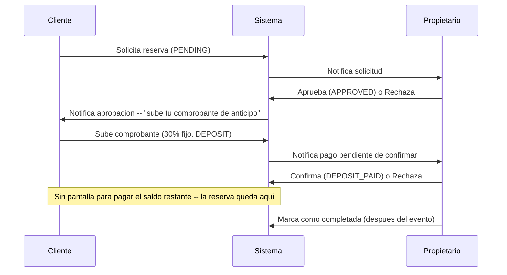
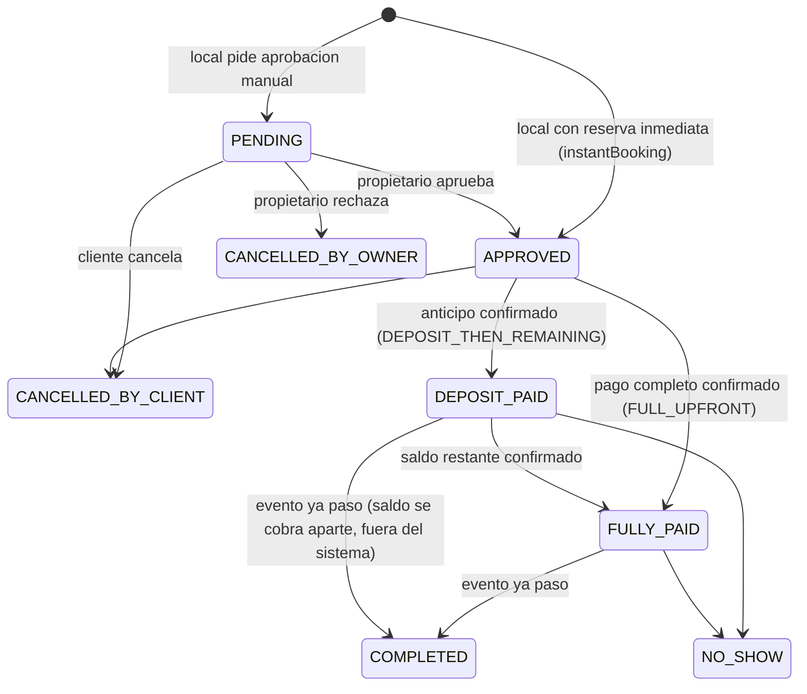
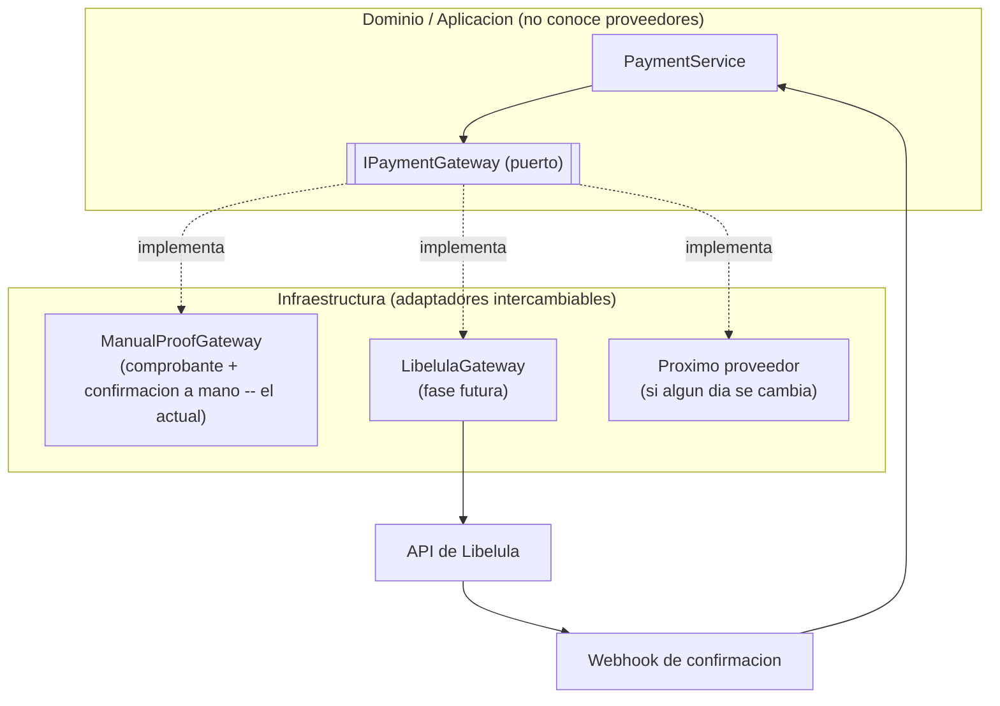

# Precios y pagos: rediseno

Plan de arquitectura para simplificar como se cobra un local, dejar que cada propietario
configure su propia politica de pago (pago completo vs. anticipo + saldo) y como se confirman
sus reservas (aprobacion manual vs. reserva inmediata), soportar locales sin precio fijo
("Cotizar"), y abstraer la pasarela de pago para poder integrar Libelula primero y cambiarla
despues sin reescribir el sistema. Este documento es la referencia base antes de tocar codigo --
se ejecuta en fases (ver "Plan de ejecucion" al final), cada una su propio PR siguiendo
[docs/git-workflow/branching-strategy.md](../git-workflow/branching-strategy.md).

## 1. Por que este documento

Disparador: un local con precio "por evento" (`priceUnit: EVENT`) cobra lo mismo si el cliente
reserva 1 dia o 5 -- confirmado en el codigo, y es **comportamiento intencional documentado**,
no un descuido (`price-calculator.service.ts:88-97`). La decision de negocio ahora es sacar esa
unidad por completo: confunde al cliente (ve el mismo precio sin importar cuantos dias elige) y
no tiene un caso de uso claro que "por dia" no cubra ya.

Al revisar el modulo de pagos para arreglar eso, aparecieron problemas mas de fondo que este
documento tambien resuelve:

- El anticipo es **30% fijo, hardcodeado en 3 lugares distintos** del codigo -- ningun
  propietario puede pedir pago completo por adelantado, ni ajustar el porcentaje.
- El flujo para pagar el **saldo restante** (`PaymentType.REMAINING`) existe en el backend pero
  **no tiene ninguna pantalla en el frontend** -- una reserva puede quedar pagada solo a medias
  sin salida.
- No hay pasarela de pago real -- todo es "el cliente sube una foto del comprobante, el
  propietario la confirma a mano". Ya hay dos columnas (`stripePaymentIntentId`,
  `stripeChargeId`) que anticipaban una integracion que nunca se completo.

## 2. Estado actual (con referencias exactas)

### 2.1 Precio

- `Venue.priceUnit`: `HOUR | DAY | EVENT` (default de todo el local).
- `VenuePrice` (`backend/prisma/schema.prisma:443-466`): reglas de excepcion sobre el precio
  base -- `priceType` (`BASE | WEEKEND | HOLIDAY | CUSTOM_DATE | SEASON_HIGH | EARLY_BIRD`),
  `dayOfWeek`, `specificDate`, `startDate`/`endDate`, `price`, `unit` (override opcional de
  `priceUnit` solo para esa regla), `discountPercent`, `discountLabel`.
- Solo `BASE`, `WEEKEND` (reusado para cualquier dia de la semana, diferenciado por
  `dayOfWeek`) y `SEASON_HIGH` tienen UI hoy, en `frontend/src/components/dashboard/venue-form.tsx`
  (pestana "Precios y capacidad", `pricingMode`: `single | weekday | weekday_season`).
  `HOLIDAY`, `CUSTOM_DATE`, `EARLY_BIRD` existen en el modelo pero no tienen formulario.
- `PriceCalculatorService.calculate()` (`price-calculator.service.ts:41-76`) resuelve que regla
  aplica en orden fijo `CUSTOM_DATE > HOLIDAY > SEASON_HIGH > WEEKEND`, si ninguna aplica usa
  `BASE`. `EARLY_BIRD` nunca se evalua ahi -- prioridad muerta.
- `calculateRange()` (`price-calculator.service.ts:98-150`) es el calculo real de una reserva
  (posiblemente multi-dia): con `EVENT`, colapsa todo el rango a un solo `calculate()` del
  primer dia y pone `0` en el resto (**la causa exacta del bug**); con `HOUR`/`DAY`, cada dia
  resuelve su propia regla aplicable y se suman.

### 2.2 Anticipo (deposito)

`depositAmount = appliedPrice * 0.3` hardcodeado, duplicado en:
`price-calculator.service.ts:62`, `price-calculator.service.ts:141`, y de nuevo en
`booking.service.ts:272` (`calculateRangeWithExtras`, al sumar el costo de los extras). No hay
ningun campo `depositPercentage` ni `paymentPolicy` en `Venue` -- confirmado por busqueda en
todo el repo, cero resultados. Todo local de la plataforma usa exactamente la misma politica
hoy: 30% de anticipo obligatorio, sin excepcion.

### 2.3 Reserva inmediata (`instantBooking`)

`Venue.instantBooking: boolean` (default `false`) ya existe hoy en el modelo, en el DTO de
creacion/edicion, como filtro de busqueda (`venue-filter.dto.ts`), como badge "Reserva
inmediata" en las tarjetas de resultado, y como checkbox real en el formulario del propietario
(`venue-form.tsx:1011`, pestana "Precios y capacidad", sin explicacion de que hace). Pero es
**puramente decorativo**: `booking.service.ts` (`requestBooking()`) nunca lo lee -- toda reserva
nace en `PENDING` sin importar este campo, asi que hoy un propietario puede marcar la casilla y
no cambia nada en el flujo real.

### 2.4 Pago

`Payment` (`backend/prisma/schema.prisma:543-568`): `amount`, `paymentType`
(`DEPOSIT | FULL | REMAINING`), `method` (`QR_BANK | BANK_TRANSFER | TIGO_MONEY | CARD | CASH`),
`status` (`PENDING | COMPLETED | FAILED | REFUNDED | PARTIAL`), `comprobanteUrl` + metadatos de
subida, `confirmedByOwnerId`/`confirmedAt`, y las columnas `stripePaymentIntentId`/
`stripeChargeId` que nunca se usan (no hay SDK de Stripe en el proyecto).

El unico punto del frontend que crea un pago es
`frontend/src/components/payments/payment-proof-drawer.tsx`, con `paymentType: 'DEPOSIT'`
**hardcodeado** (linea 36) -- nunca se ofrece pagar `REMAINING` ni `FULL`, aunque el backend ya
lo valida correctamente (`payment.service.ts:66-86`, exige que el monto coincida exacto con lo
esperado segun el tipo).

`PaymentService.confirmPayment()` decide el nuevo estado de la reserva segun el tipo de pago
confirmado (`payment.repository.ts:141`): `DEPOSIT` completado -> `DEPOSIT_PAID`;
`FULL`/`REMAINING` completado -> `FULLY_PAID`.

### 2.5 Diagrama del flujo actual



## 3. Problemas a resolver

| # | Problema | Impacto |
|---|---|---|
| 1 | `EVENT` cobra igual sin importar los dias | Cliente confundido, propietario pierde ingreso en reservas largas |
| 2 | Anticipo 30% fijo, en 3 lugares | Ningun propietario puede pedir pago completo o ajustar el % |
| 3 | Sin pantalla para pagar el saldo restante | Reservas quedan pagadas a medias sin salida |
| 4 | Sin pasarela real, todo manual | Mas pasos, mas espera, mas trabajo de verificacion para el propietario |
| 5 | Sin abstraccion de pasarela | Integrar Libelula ahora atascaria el codigo a un solo proveedor |
| 6 | `instantBooking` esta en el formulario del propietario pero no hace nada | El propietario cree que ya activo reservas directas y sigue teniendo que aprobar cada una a mano |
| 7 | Un local sin precio fijo no tiene forma de publicarse | Locales que cobran "segun el evento" (catering, decoracion a medida) no pueden usar la plataforma sin inventar un precio que no es real |

## 4. Diseno propuesto

### 4.1 Sacar `EVENT`, dejar solo `HOUR` y `DAY`

`PriceUnit` pasa a `HOUR | DAY`. Migracion de datos: todo local con `priceUnit: EVENT` pasa a
`DAY` -- es la conversion mas directa (un local que hoy cobra "Bs 2000 por evento" pasa a cobrar
"Bs 2000 por dia", que es ademas exactamente la logica que ya corrige el bug sin tocar el
calculo de `DAY`, que ya suma correctamente por rango). Esto **cambia el precio efectivo de una
reserva multi-dia** para esos locales -- antes de correr la migracion hay que avisarle a cada
propietario afectado (notificacion in-app + email) para que revise su precio base si quiere.

Cambios de codigo:
- Migracion de Prisma: `UPDATE venues SET price_unit = 'DAY' WHERE price_unit = 'EVENT'`, y
  recien despues eliminar `EVENT` del enum (en ese orden, para no romper filas existentes).
- Borrar la rama `EVENT` completa de `calculateRange()` (`price-calculator.service.ts:109-125`)
  -- despues de la migracion nunca se vuelve a ejecutar.
- Sacar la opcion "Evento" del selector de unidad en `venue-form.tsx` y de cualquier
  `priceUnitLabel` map en el frontend (galeria de resultados, detalle del local, resumen de
  reserva).
- Actualizar `tests/unit/booking/price-calculator.service.spec.ts` (los tests que documentan el
  comportamiento `EVENT` se borran, no se "arreglan" -- el comportamiento deja de existir).

### 4.2 Politica de pago configurable por local

Nuevo campo en `Venue`:

```prisma
enum PaymentPolicy {
  FULL_UPFRONT          // un solo pago, cubre el 100%
  DEPOSIT_THEN_REMAINING // anticipo + saldo restante (el default actual, para no
                          // sorprender a los locales ya publicados)
}

model Venue {
  // ...
  paymentPolicy     PaymentPolicy @default(DEPOSIT_THEN_REMAINING) @map("payment_policy")
  depositPercentage Decimal?      @default(30) @db.Decimal(5, 2) @map("deposit_percentage")
  // depositPercentage se ignora cuando paymentPolicy = FULL_UPFRONT
}
```

- UI: nueva seccion "Politica de pago" en la pestana de precios del formulario del propietario
  -- radio `Pago completo por adelantado` / `Anticipo + saldo restante`, con un slider o input
  numerico para el porcentaje (limitado a un rango razonable, ej. 10%-90%) que solo aparece con
  la segunda opcion.
- **Se centraliza el calculo del deposito en un solo lugar** (hoy duplicado 3 veces): un metodo
  unico, por ejemplo `PriceCalculatorService.resolveDeposit(venue, totalPrice)`, que devuelve
  `totalPrice` completo si `FULL_UPFRONT`, o `totalPrice * (depositPercentage / 100)` si
  `DEPOSIT_THEN_REMAINING`. Los 3 sitios que hoy hardcodean `* 0.3` pasan a llamar a este metodo.
- El tipo de pago que se le ofrece al cliente deja de estar fijo en el frontend: se **deriva del
  estado de la reserva y la politica del local**, no de una eleccion libre --
  ver 4.3.

### 4.2.1 Reserva inmediata: saltar la aprobacion manual (opcional por local)

Idea del propietario: algunos manejan su calendario 100% desde la app y no quieren el paso
manual de aprobar/rechazar cada solicitud -- quieren que, si las fechas estan libres, la reserva
quede lista al toque y el cliente pase directo a pagar. Otros prefieren revisar cada solicitud
antes de comprometerse (evento raro, cliente nuevo, quieren llamar primero). Como vimos en 2.3,
la base para esto **ya existe** (`Venue.instantBooking`, incluida la casilla en el formulario del
propietario) -- lo que falta es conectarla:

- `BookingService.requestBooking()` lee `venue.instantBooking`. Si es `true` y no hubo conflicto
  de fechas (la validacion de disponibilidad ya corre igual, nada de eso cambia), la reserva se
  crea directo en `APPROVED` en vez de `PENDING` -- salta el paso de aprobar/rechazar, no salta
  la validacion de disponibilidad ni el calculo de precio.
- El cliente ve el mismo siguiente paso que hoy ve despues de que el propietario aprueba: subir
  el comprobante segun la politica de pago del local (4.2) -- **no cambia nada del lado del
  pago**, solo se salta la espera de que un humano apruebe.
- El propietario igual recibe la notificacion de la reserva nueva (mismo `BOOKING_REQUEST`),
  solo que ahora es informativa ("ya se confirmo") en vez de accionable ("aproba o rechaza").
- **UI**: en vez de dejar la casilla suelta y sin explicacion como esta hoy, se mueve junto a la
  seccion "Politica de pago" del formulario (4.2) bajo un titulo comun tipo "Como se confirman
  tus reservas", con una sola linea de ayuda: *"Si esta activado, la reserva se confirma
  automaticamente en cuanto el cliente reserva la fecha, sin que tengas que aprobarla vos."* Es
  la pieza que hace esta seccion "mas amigable para el propietario" (el pedido original del
  usuario para el dashboard de politica de pago) -- dos decisiones relacionadas (como se
  confirma, como se cobra) en un solo lugar en vez de dos casillas sueltas en pestañas distintas.
- **Fuera de alcance de esta fase**: hoy un propietario no tiene forma de cancelar una reserva ya
  `APPROVED` (`VenueEntity.canBeCancelledByOwner()` existe en el dominio pero no tiene ningun
  endpoint que lo use -- codigo muerto, confirmado por busqueda en el repo). Con reserva
  inmediata activada esto se nota mas (nunca hay un paso de "rechazar" antes de comprometerse), 
  pero conectar esa cancelacion es un problema aparte, no exclusivo de `instantBooking` -- se
  deja anotado para un futuro documento, no se resuelve aca.

### 4.3 Completar el flujo de pago (antes de tocar la pasarela)

Con la politica configurable, el flujo de pago que le corresponde a cada reserva queda asi:



Antes de meter una pasarela nueva, se termina el camino manual que ya existe -- asi la
abstraccion del paso 4.4 envuelve un flujo completo, no uno a medias:

- **Pantalla para pagar el saldo restante**: mismo componente que ya sube comprobantes
  (`payment-proof-drawer.tsx`), disparado desde la vista de detalle de reserva del cliente
  (`booking-detail-client.tsx`) cuando `booking.status === 'DEPOSIT_PAID'`, con
  `paymentType: 'REMAINING'` y el monto ya calculado (`totalPrice - depositAmount`, redondeado a
  centavos), no editable por el cliente. **Hecho** (Fase 2) -- el boton solo aparece si no hay ya
  un comprobante `REMAINING` pendiente de confirmacion (si lo hay, se muestra un mensaje de
  espera en su lugar).
- **El tipo de pago deja de ser una eleccion libre**: el drawer recibe el `paymentType`
  correcto como prop segun de donde se lo invoco (aprobada+sin pagos -> `DEPOSIT` o `FULL` segun
  la politica del local; con anticipo ya pagado -> `REMAINING`), en vez de tenerlo hardcodeado.
  Esto tambien cierra la puerta a que un cliente suba un comprobante del tipo equivocado. **Hecho
  por completo** -- la mitad `DEPOSIT`/`FULL` se adelanto a la Fase 1 (ver la tabla de abajo), y
  la mitad `REMAINING` se cerro en la Fase 2. Ademas, el backend ahora valida por su cuenta que
  cada `paymentType` solo se pueda crear desde el `BookingStatus` que le corresponde
  (`DEPOSIT`/`FULL` solo desde `APPROVED`, `REMAINING` solo desde `DEPOSIT_PAID`) y bloquea un
  segundo comprobante del mismo tipo mientras el anterior sigue `PENDING` -- no es solo disciplina
  del frontend, el backend no confia en el `paymentType` que le llega sin revalidarlo contra el
  estado real de la reserva.
- **Reducir el ida-y-vuelta percibido**: el modal de detalle de reserva del propietario (ya
  construido, `frontend/src/components/dashboard/owner-booking-management.tsx`) suma una
  seccion "Estado de pago" con una linea de tiempo simple (Anticipo: pagado/revisando
  comprobante/pendiente · Saldo: pagado/revisando comprobante/pendiente/no aplica) en vez de que
  el propietario tenga que cruzar datos entre la tarjeta de la reserva y la seccion separada de
  "Pagos pendientes" para entender en que paso esta cada una. **Hecho** (Fase 2).

### 4.4 Pasarela de pago abstraida (Ports & Adapters)

Mismo patron que ya usa el resto del backend para repositorios (`IVenueRepository` +
`VENUE_REPOSITORY` como token de inyeccion, `IPaymentRepository` + `PAYMENT_REPOSITORY`) --
se define un puerto para la pasarela y el dominio nunca depende de un proveedor concreto:

```typescript
// backend/src/modules/payment/domain/gateways/payment-gateway.interface.ts
export const PAYMENT_GATEWAY = Symbol('PAYMENT_GATEWAY');

export interface IPaymentGateway {
  // Arranca un cobro. El manual devuelve instrucciones (numero de cuenta/QR estatico);
  // un proveedor real devuelve una URL de pago o los datos de un QR dinamico.
  createCharge(input: {
    paymentId: string;
    amount: number;
    currency: string;
    description: string;
  }): Promise<{ externalReference: string; redirectUrl?: string; qrData?: string }>;

  // Solo lo implementan proveedores que soportan confirmacion automatica (Libelula si).
  // El adaptador manual lo deja sin implementar -- la confirmacion sigue siendo manual,
  // por eso el metodo devuelve null en vez de forzar un webhook que no existe.
  verifyWebhookSignature?(payload: unknown, signature: string): boolean;

  refund(externalReference: string, amount?: number): Promise<{ success: boolean }>;
}
```

Adaptadores:



- Cual adaptador esta activo se decide por configuracion (variable de entorno
  `PAYMENT_GATEWAY_PROVIDER=manual|libelula`), inyectado una sola vez en el modulo de Nest
  (mismo patron `useFactory`/`useClass` que ya usan otros providers del proyecto). Cambiar de
  proveedor el dia de manana es escribir un adaptador nuevo + un valor de config, sin tocar
  `PaymentService` ni nada de dominio.
- El adaptador manual (`ManualProofGateway`) **envuelve exactamente el flujo que ya existe hoy**
  -- se construye primero, sin cambiar ningun comportamiento, solo para validar que el puerto
  esta bien disenado antes de escribir un segundo adaptador real.

### 4.5 Adaptador Libelula (fase futura, alcance alto nivel)

Se detalla en su propio documento cuando se llegue a esa fase (necesita revisar la
documentacion real de la API de Libelula, que todavia no se reviso). A alto nivel va a implicar:

- `LibelulaGateway implements IPaymentGateway` -- `createCharge()` llama a su API para generar
  un link/QR de pago; `verifyWebhookSignature()` valida la firma de su webhook.
- Un endpoint nuevo `POST /api/v1/payments/webhooks/libelula` (publico, con validacion de firma)
  que recibe la confirmacion y llama a la misma logica que hoy usa `confirmPayment()` -- la
  diferencia es quien la dispara (un webhook en vez del propietario tocando un boton).
- El comprobante manual sigue disponible como respaldo -- no todos los propietarios ni clientes
  van a preferir la pasarela de entrada, sobre todo al principio.

### 4.6 Modo "Cotizar" (locales sin precio fijo)

Idea del propietario: no todos los locales tienen un precio fijo publicable -- algunos cobran
"segun el evento" (numero de invitados, servicios adicionales, temporada) y hoy no pueden
publicarse sin inventar un precio base que no es real (confirmado en 2.1: `basePrice` es
obligatorio, sin excepcion, en todo el formulario y validacion actual). Para estos, el pedido es
un boton "Cotizar" que abra el contacto con el propietario en vez del flujo de reserva con
precio.

Esto es un **modo distinto de publicar el local**, no una opcion mas de la politica de pago
(4.2) -- resuelve "¿cuanto cuesta?" en vez de "¿como se cobra?", y son preguntas independientes:
un local puede pedir cotizacion y, una vez que el propietario le pone un precio a esa
cotizacion puntual, igual aplica su politica de anticipo/pago completo de siempre. Por eso se
documenta a alto nivel aca -- igual que 4.5 con Libelula -- y se detalla en su propio momento en
vez de sobre-disenarlo ahora:

```prisma
enum PricingMode {
  FIXED_PRICE  // el actual: precio base obligatorio, reserva con precio calculado
  QUOTE_ONLY   // sin precio publicado, el cliente pide cotizacion
}

model Venue {
  // ...
  pricingMode PricingMode @default(FIXED_PRICE) @map("pricing_mode")
  // con QUOTE_ONLY, basePrice deja de ser obligatorio en el formulario y en la validacion
}
```

A alto nivel, lo que cambia por capa:

- **Formulario del propietario**: con `pricingMode: QUOTE_ONLY`, se oculta la seccion de precio
  base/reglas (4.2 no aplica hasta que el local tenga un precio real que cobrar) y la seccion
  "Politica de pago" queda deshabilitada con una nota -- no hay nada que cobrar todavia.
- **Detalle del local (cliente)**: donde hoy esta el precio y el boton "Solicitar reserva", con
  `QUOTE_ONLY` aparece "Consultar precio" y un boton "Cotizar" en su lugar.
- **La solicitud de cotizacion no es una reserva con precio** -- es una nueva entidad liviana
  (ej. `QuoteRequest`: fechas tentativas, cantidad de invitados, mensaje del cliente, datos de
  contacto) que aparece en el dashboard del propietario junto a sus solicitudes de reserva, pero
  claramente marcada como "cotizacion pendiente", no como una reserva. El punto de entrada
  natural es el mismo canal de contacto que ya existe hoy (el link de WhatsApp del local, ya
  usado en el modal de detalle de reserva del propietario) para no duplicar un sistema de
  mensajeria propio.
- **De cotizacion a reserva real**: cuando el propietario y el cliente acuerdan un precio (fuera
  o dentro del sistema, a definir), el propietario le pone un precio a esa solicitud puntual --
  recien ahi se convierte en una reserva de verdad y entra al mismo flujo de siempre (aprobacion
  si aplica, politica de pago del local si ya la tiene configurada, o una politica puntual para
  ese evento). El diseno exacto de ese "convertir cotizacion en reserva" (¿un campo de precio
  editable en el detalle de la solicitud? ¿arranca siempre en `PENDING` sin importar
  `instantBooking`, porque recien se definio el precio?) se resuelve cuando se llegue a esta
  fase, no ahora.

Fuera de alcance de este documento por ahora: cotizacion parcial de items (ej. cotizar solo el
salon vs. salon+catering por separado) -- se arranca con una cotizacion, un local, un precio
final.

## 5. Plan de ejecucion

Cada fase es su propio PR contra `develop`, en este orden (cada una depende de que la anterior
ya este mergeada):

| Estado | Fase | Que incluye | Tamano | Por que en este orden |
|---|---|---|---|---|
| Hecho | **0** | Sacar `EVENT`: migracion de datos, borrar rama muerta del calculo, actualizar UI y tests | Chico | Corrige lo que ya esta confundiendo a un cliente hoy; no depende de nada mas |
| Hecho | **1** | `paymentPolicy` + `depositPercentage` en `Venue`, centralizar el calculo del deposito, conectar `instantBooking` en `requestBooking()` (4.2.1), UI unificada "Como se confirman tus reservas / Como se cobran" en el dashboard. Suma tambien el `paymentType` derivado (`DEPOSIT`/`FULL`) del primer pago -- se adelanto de la Fase 2 porque, sin esto, una reserva con `FULL_UPFRONT` quedaba mal marcada `DEPOSIT_PAID` en vez de `FULLY_PAID` (bug real encontrado probando la fase, no solo teorico) | Mediano | La pasarela (fase 3) necesita saber si el local pide anticipo o pago completo -- se define antes. `instantBooking` entra en la misma fase porque comparte pantalla y es chico (una condicion, sin modelo nuevo) |
| Hecho | **2** | Pantalla de saldo restante (`paymentType: REMAINING`, boton en el detalle de reserva del cliente), seccion "Estado de pago" en el modal de reserva del propietario. Suma tambien validacion de `paymentType` por `BookingStatus` en el backend, redondeo de centavos consistente frontend/backend, y bloqueo de un segundo comprobante pendiente del mismo tipo -- tres bugs reales encontrados probando la fase | Mediano | Completa el flujo manual antes de abstraerlo -- la fase 3 envuelve algo terminado, no a medias |
| Pendiente | **3** | `IPaymentGateway` + `ManualProofGateway` (mismo comportamiento de hoy, solo reorganizado detras del puerto) | Chico-mediano | Refactor puro, sin cambio de comportamiento -- valida que el diseno del puerto sirve antes de sumar un proveedor real |
| Pendiente | **4** | `LibelulaGateway` + webhook + rollout | Grande, proyecto aparte | Necesita su propia investigacion de la API de Libelula antes de estimarse en detalle |
| Pendiente | **5** | Modo "Cotizar" (`pricingMode`, `QuoteRequest`, boton "Cotizar" en el detalle del local, bandeja de cotizaciones en el dashboard) -- ver 4.6 | Mediano-grande, requiere su propio diseno de detalle | Independiente del resto (resuelve "cuanto cuesta", no "como se cobra") -- solo depende de la Fase 0 por compartir el modelo de precio. Puede ejecutarse en paralelo a las fases 2-4 |

Diagramas actualizados con el estado real de cada flujo: [payment-flows.html](payment-flows.html).

## 6. Fuera de alcance (por ahora)

- Seleccion de pasarela **por local/propietario** (cada uno con su propio proveedor) -- se arranca
  con un proveedor activo a nivel plataforma. Si en el futuro hace falta multi-proveedor por
  local, el puerto ya esta diseñado para soportarlo sin romper nada, pero no se construye hasta
  que sea un requisito real.
- Reembolsos automaticos -- el puerto define `refund()` para no bloquear el diseño, pero la
  logica de cuando reembolsar (cancelaciones, disputas) es una decision de producto aparte.
  Se abre despues, cuando la Fase 4 este en marcha.
- Pagos parciales fuera de deposito/saldo (ej. planes de cuotas) -- no pedido, no se diseña.
- Cancelacion por parte del propietario de una reserva ya `APPROVED`/`DEPOSIT_PAID` (conectar
  `VenueEntity.canBeCancelledByOwner()`, hoy codigo muerto) -- se nota mas con reserva inmediata
  (4.2.1) porque ahi nunca hubo un paso de "rechazar" antes de comprometerse, pero es un problema
  del flujo de cancelacion en general, no exclusivo de esta fase. Documento aparte cuando se
  priorice.
