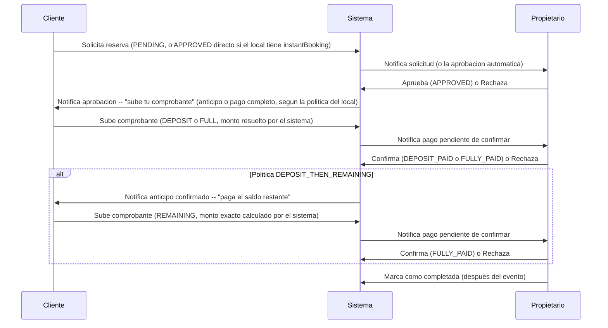
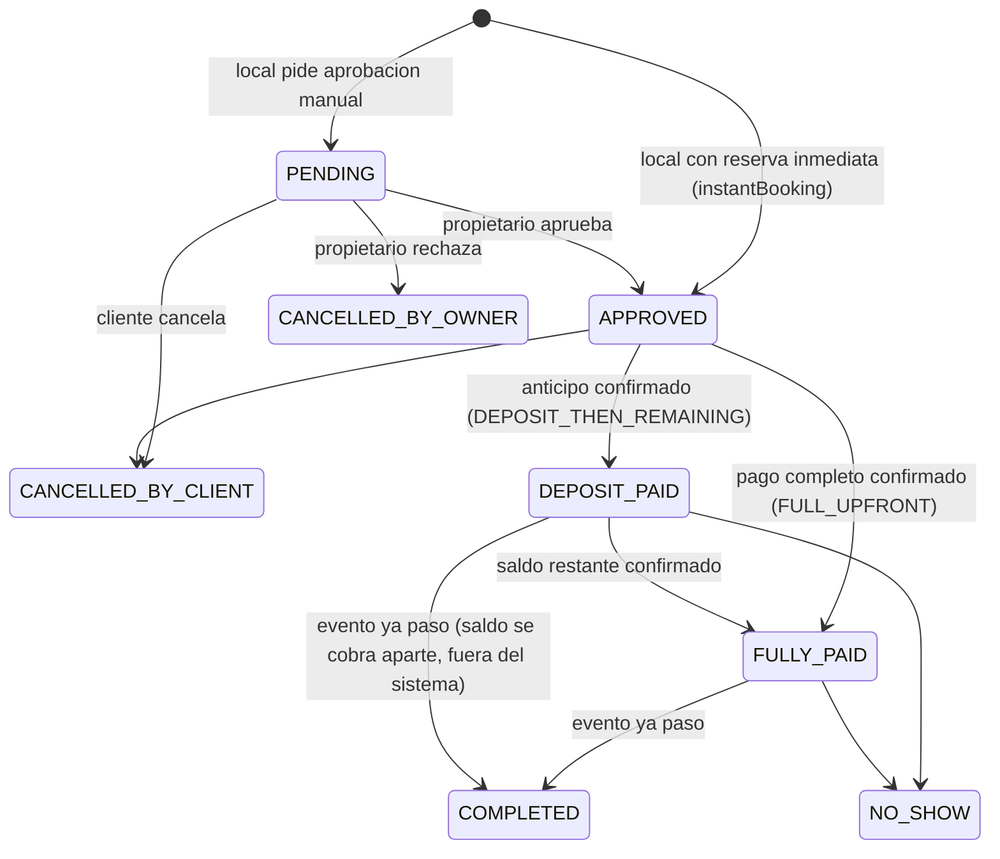
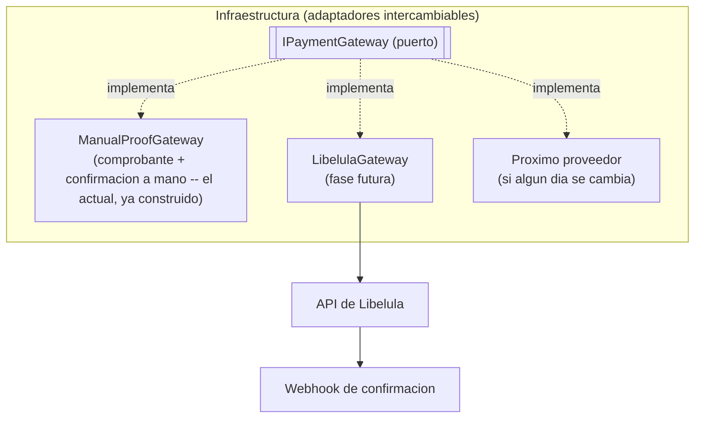

# Precios y pagos: rediseno

Plan de arquitectura para simplificar como se cobra un local, dejar que cada propietario
configure su propia politica de pago (pago completo vs. anticipo + saldo) y como se confirman
sus reservas (aprobacion manual vs. reserva inmediata), soportar locales sin precio fijo
("Cotizar"), y abstraer la pasarela de pago para poder integrar Libelula primero y cambiarla
despues sin reescribir el sistema. Este documento es la referencia base antes de tocar codigo --
se ejecuta en fases (ver "Plan de ejecucion" al final), cada una su propio PR siguiendo
[docs/git-workflow/branching-strategy.md](../git-workflow/branching-strategy.md).

## 1. Por que este documento

Disparador original: un local con precio "por evento" (`priceUnit: EVENT`) cobraba lo mismo si
el cliente reservaba 1 dia o 5 -- confirmado en el codigo como **comportamiento intencional
documentado**, no un descuido. Confundia al cliente (veia el mismo precio sin importar cuantos
dias elegia) y no tenia un caso de uso claro que "por dia" no cubriera ya. **Ya se resolvio**
(Fase 0): `EVENT` se saco por completo del enum `PriceUnit`.

Al revisar el modulo de pagos para arreglar eso, aparecieron problemas mas de fondo, que tambien
quedaron resueltos en las fases siguientes:

- El anticipo era **30% fijo, hardcodeado en 3 lugares distintos** del codigo -- ningun
  propietario podia pedir pago completo por adelantado, ni ajustar el porcentaje. **Ya se
  resolvio** (Fase 1): `paymentPolicy` + `depositPercentage` configurables por local, calculo
  centralizado en `PriceCalculatorService.resolveDeposit()`.
- El flujo para pagar el **saldo restante** (`PaymentType.REMAINING`) existia en el backend pero
  no tenia ninguna pantalla en el frontend -- una reserva podia quedar pagada solo a medias sin
  salida. **Ya se resolvio** (Fase 2): pantalla de pago del saldo restante en el detalle de
  reserva del cliente, mas validaciones de integridad por `BookingStatus` en el backend.
- Sigue sin haber pasarela de pago real -- todo es "el cliente sube una foto del comprobante, el
  propietario la confirma a mano". **La abstraccion ya esta lista** (Fase 3): `IPaymentGateway` +
  `ManualProofGateway` envuelven el flujo manual actual detras de un puerto, sin cambiar nada del
  comportamiento. Lo que **sigue pendiente** es el proveedor real (Fase 4, `LibelulaGateway`, ver
  seccion 4.4 en adelante). Ya hay dos columnas (`stripePaymentIntentId`, `stripeChargeId`) en el
  modelo `Payment` que anticipaban una integracion que nunca se completo.

## 2. Estado actual (con referencias exactas)

### 2.1 Precio

- `Venue.priceUnit`: `HOUR | DAY` (`EVENT` se saco del enum en la Fase 0 --
  `backend/prisma/schema.prisma:90-93`).
- `VenuePrice` (`backend/prisma/schema.prisma:450-473`): reglas de excepcion sobre el precio
  base -- `priceType` (`BASE | WEEKEND | HOLIDAY | CUSTOM_DATE | SEASON_HIGH | EARLY_BIRD`),
  `dayOfWeek`, `specificDate`, `startDate`/`endDate`, `price`, `unit` (override opcional de
  `priceUnit` solo para esa regla), `discountPercent`, `discountLabel`.
- Solo `BASE`, `WEEKEND` (reusado para cualquier dia de la semana, diferenciado por
  `dayOfWeek`) y `SEASON_HIGH` tienen UI hoy, en `frontend/src/components/dashboard/venue-form.tsx`
  (pestana "Precios y capacidad", `pricingMode`: `single | weekday | weekday_season`).
  `HOLIDAY`, `CUSTOM_DATE`, `EARLY_BIRD` existen en el modelo pero todavia no tienen formulario.
- `PriceCalculatorService.calculate()` (`price-calculator.service.ts:57-97`) resuelve que regla
  aplica en orden fijo `CUSTOM_DATE > HOLIDAY > SEASON_HIGH > WEEKEND` (`findApplicablePrice()`,
  lineas 173-200); si ninguna aplica usa `BASE`. `EARLY_BIRD` nunca se evalua ahi -- prioridad
  muerta, sigue sin resolverse (fuera del alcance de este documento).
- `calculateRange()` (`price-calculator.service.ts:115-151`) es el calculo real de una reserva
  (posiblemente multi-dia): cada dia resuelve su propia unidad efectiva
  (`resolveUnitForDate()`, linea 104) y su propia regla aplicable, y el total es la suma de
  todos los dias -- una reserva mas larga siempre cuesta mas. Ya no existe la rama `EVENT` que
  colapsaba todo el rango a un solo dia.

### 2.2 Anticipo (deposito)

`PriceCalculatorService.resolveDeposit(paymentPolicy, depositPercentage, totalPrice)`
(`price-calculator.service.ts:46-55`) es el unico lugar que calcula un anticipo: devuelve el
`totalPrice` completo si la politica del local es `FULL_UPFRONT`, o
`totalPrice * (depositPercentage / 100)` en cualquier otro caso. Los 3 lugares que antes
hardcodeaban `* 0.3` ahora llaman a este metodo. `Venue.paymentPolicy` (default
`DEPOSIT_THEN_REMAINING`) y `Venue.depositPercentage` (default `30`, rango valido 10-90, ver
`CreateVenueDto`) son campos reales en `backend/prisma/schema.prisma:254-256`, configurables
desde la seccion "Politica de pago" del formulario del propietario.

### 2.3 Reserva inmediata (`instantBooking`)

`Venue.instantBooking: boolean` (default `false`) ya esta conectado:
`BookingService.requestBooking()` (`booking.service.ts:163`) calcula
`initialStatus = venue.instantBooking ? APPROVED : PENDING` y crea la reserva directo en ese
estado -- la validacion de disponibilidad y el calculo de precio no cambian, solo se salta el
paso de aprobar/rechazar. La UI (checkbox en `venue-form.tsx`, badge "Reserva inmediata" en las
tarjetas de resultado, filtro de busqueda) es la misma que ya existia antes, ahora con
comportamiento real detras.

### 2.4 Pago

`Payment` (`backend/prisma/schema.prisma:550-575`): `amount`, `paymentType`
(`DEPOSIT | FULL | REMAINING`), `method` (`QR_BANK | BANK_TRANSFER | TIGO_MONEY | CARD | CASH`),
`status` (`PENDING | COMPLETED | FAILED | REFUNDED | PARTIAL`), `comprobanteUrl` + metadatos de
subida, `confirmedByOwnerId`/`confirmedAt`, y las columnas `stripePaymentIntentId`/
`stripeChargeId` que siguen sin usarse (no hay SDK de Stripe en el proyecto).

`frontend/src/components/payments/payment-proof-drawer.tsx` recibe `paymentType` como prop
obligatoria -- ya no esta hardcodeado. Quien decide ese valor es `resolvePayableAction()` en
`booking-detail-client.tsx:38-54`: `DEPOSIT` o `FULL` (segun la politica del local) si la
reserva esta `APPROVED`, `REMAINING` si esta `DEPOSIT_PAID`, y sin boton de pago en cualquier
otro estado -- mismos gates que exige el backend.

`PaymentService.createPayment()` (`payment.service.ts:68-124`) valida, ademas del monto exacto
por tipo (con redondeo a centavos para `REMAINING`), que el `paymentType` corresponda al
`BookingStatus` real de la reserva, y bloquea un segundo comprobante del mismo tipo mientras el
anterior sigue `PENDING`.

`PaymentService.confirmPayment()` decide el nuevo estado de la reserva segun el tipo de pago
confirmado (`payment.repository.ts:141`): `DEPOSIT` completado -> `DEPOSIT_PAID`;
`FULL`/`REMAINING` completado -> `FULLY_PAID`.

### 2.5 Diagrama del flujo actual



## 3. Problemas a resolver

| # | Problema | Impacto | Estado |
|---|---|---|---|
| 1 | `EVENT` cobraba igual sin importar los dias | Cliente confundido, propietario perdia ingreso en reservas largas | Resuelto (Fase 0) |
| 2 | Anticipo 30% fijo, en 3 lugares | Ningun propietario podia pedir pago completo o ajustar el % | Resuelto (Fase 1) |
| 3 | Sin pantalla para pagar el saldo restante | Reservas quedaban pagadas a medias sin salida | Resuelto (Fase 2) |
| 4 | Sin pasarela real, todo manual | Mas pasos, mas espera, mas trabajo de verificacion para el propietario | Pendiente (Fase 4) |
| 5 | Sin abstraccion de pasarela | Integrar Libelula ahora atascaria el codigo a un solo proveedor | Resuelto (Fase 3) |
| 6 | `instantBooking` estaba en el formulario del propietario pero no hacia nada | El propietario creia que ya activo reservas directas y seguia teniendo que aprobar cada una a mano | Resuelto (Fase 1) |
| 7 | Un local sin precio fijo no tiene forma de publicarse | Locales que cobran "segun el evento" (catering, decoracion a medida) no pueden usar la plataforma sin inventar un precio que no es real | Pendiente (Fase 5) |

## 4. Diseno propuesto

### 4.1 Sacar `EVENT`, dejar solo `HOUR` y `DAY` (Fase 0 -- hecho)

`PriceUnit` paso a `HOUR | DAY` (`backend/prisma/schema.prisma:90-93`). La migracion de datos
llevo todo local con `priceUnit: EVENT` a `DAY` -- la conversion mas directa (un local que
cobraba "Bs 2000 por evento" pasa a cobrar "Bs 2000 por dia", que ademas es exactamente la
logica que corrige el bug sin tocar el calculo de `DAY`, que ya sumaba correctamente por rango).

Cambios que se hicieron:
- Migracion de Prisma que actualizo las filas existentes (`price_unit = 'DAY'` donde era
  `EVENT`) antes de eliminar `EVENT` del enum, en ese orden, para no romper filas existentes.
- Se borro la rama `EVENT` completa de `calculateRange()` -- ya no se vuelve a ejecutar.
- Se saco la opcion "Evento" del selector de unidad en `venue-form.tsx` y de cualquier
  `priceUnitLabel` map en el frontend (galeria de resultados, detalle del local, resumen de
  reserva).
- Se actualizo `tests/unit/booking/price-calculator.service.spec.ts` -- los tests que
  documentaban el comportamiento `EVENT` se borraron, no se "arreglaron" (el comportamiento dejo
  de existir).

### 4.2 Politica de pago configurable por local (Fase 1 -- hecho)

Campo nuevo en `Venue` (`backend/prisma/schema.prisma:95-98, 254-256`):

```prisma
enum PaymentPolicy {
  FULL_UPFRONT           // un solo pago, cubre el 100%
  DEPOSIT_THEN_REMAINING // anticipo + saldo restante (el default, el comportamiento de siempre)
}

model Venue {
  // ...
  paymentPolicy     PaymentPolicy @default(DEPOSIT_THEN_REMAINING) @map("payment_policy")
  depositPercentage Decimal       @default(30) @db.Decimal(5, 2) @map("deposit_percentage")
  // depositPercentage se ignora cuando paymentPolicy = FULL_UPFRONT
}
```

- UI: seccion "Politica de pago" en la pestana de precios del formulario del propietario --
  radio `Pago completo por adelantado` / `Anticipo + saldo restante`, con un input numerico para
  el porcentaje (limitado a 10%-90%) que solo aparece con la segunda opcion.
- El calculo del deposito quedo centralizado en `PriceCalculatorService.resolveDeposit()` (ver
  2.2) -- ya no hay ningun `* 0.3` hardcodeado en el codigo.
- El tipo de pago que se le ofrece al cliente ya no esta fijo en el frontend: se deriva del
  estado de la reserva y la politica del local (ver 2.4 y 4.3), no de una eleccion libre.

### 4.2.1 Reserva inmediata: saltar la aprobacion manual (opcional por local) (Fase 1 -- hecho)

Idea del propietario: algunos manejan su calendario 100% desde la app y no quieren el paso
manual de aprobar/rechazar cada solicitud -- quieren que, si las fechas estan libres, la reserva
quede lista al toque y el cliente pase directo a pagar. Otros prefieren revisar cada solicitud
antes de comprometerse (evento raro, cliente nuevo, quieren llamar primero). `Venue.instantBooking`
ya existia (ver 2.3) pero era decorativo -- ahora esta conectado:

- `BookingService.requestBooking()` (`booking.service.ts:163`) lee `venue.instantBooking`. Si es
  `true` y no hay conflicto de fechas (la validacion de disponibilidad corre igual, nada de eso
  cambio), la reserva se crea directo en `APPROVED` en vez de `PENDING` -- salta el paso de
  aprobar/rechazar, no la validacion de disponibilidad ni el calculo de precio.
- El cliente ve el mismo siguiente paso que ya veia despues de que el propietario aprobaba:
  subir el comprobante segun la politica de pago del local (4.2) -- no cambio nada del lado del
  pago, solo se salta la espera de que un humano apruebe.
- El propietario igual recibe la notificacion de la reserva nueva (mismo `BOOKING_REQUEST`),
  solo que ahora es informativa ("ya se confirmo") en vez de accionable ("aproba o rechaza").
- **UI**: la casilla se movio junto a la seccion "Politica de pago" del formulario (4.2) bajo un
  titulo comun "Como se confirman tus reservas", con una linea de ayuda: *"Si esta activado, la
  reserva se confirma automaticamente en cuanto el cliente reserva la fecha, sin que tengas que
  aprobarla vos."*
- **Sigue fuera de alcance**: un propietario todavia no tiene forma de cancelar una reserva ya
  `APPROVED` (`VenueEntity.canBeCancelledByOwner()` existe en el dominio pero no tiene ningun
  endpoint que lo use -- codigo muerto, confirmado por busqueda en el repo). Con reserva
  inmediata activada esto se nota mas (nunca hay un paso de "rechazar" antes de comprometerse),
  pero conectar esa cancelacion sigue siendo un problema aparte, no exclusivo de `instantBooking`
  -- no resuelto en ninguna fase todavia.

### 4.3 Completar el flujo de pago (antes de tocar la pasarela) (Fase 2 -- hecho)

Con la politica configurable, el flujo de pago que le corresponde a cada reserva queda asi:



Antes de meter una pasarela nueva, se termina el camino manual que ya existe -- asi la
abstraccion del paso 4.4 envuelve un flujo completo, no uno a medias:

- **Pantalla para pagar el saldo restante**: mismo componente que ya sube comprobantes
  (`payment-proof-drawer.tsx`), disparado desde la vista de detalle de reserva del cliente
  (`booking-detail-client.tsx`) cuando `booking.status === 'DEPOSIT_PAID'`, con
  `paymentType: 'REMAINING'` y el monto ya calculado (`totalPrice - depositAmount`, redondeado a
  centavos), no editable por el cliente. **Hecho** (Fase 2) -- el boton solo aparece si no hay ya
  un comprobante `REMAINING` pendiente de confirmacion (si lo hay, se muestra un mensaje de
  espera en su lugar).
- **El tipo de pago deja de ser una eleccion libre**: el drawer recibe el `paymentType`
  correcto como prop segun de donde se lo invoco (aprobada+sin pagos -> `DEPOSIT` o `FULL` segun
  la politica del local; con anticipo ya pagado -> `REMAINING`), en vez de tenerlo hardcodeado.
  Esto tambien cierra la puerta a que un cliente suba un comprobante del tipo equivocado. **Hecho
  por completo** -- la mitad `DEPOSIT`/`FULL` se adelanto a la Fase 1 (ver la tabla de abajo), y
  la mitad `REMAINING` se cerro en la Fase 2. Ademas, el backend ahora valida por su cuenta que
  cada `paymentType` solo se pueda crear desde el `BookingStatus` que le corresponde
  (`DEPOSIT`/`FULL` solo desde `APPROVED`, `REMAINING` solo desde `DEPOSIT_PAID`) y bloquea un
  segundo comprobante del mismo tipo mientras el anterior sigue `PENDING` -- no es solo disciplina
  del frontend, el backend no confia en el `paymentType` que le llega sin revalidarlo contra el
  estado real de la reserva.
- **Reducir el ida-y-vuelta percibido**: el modal de detalle de reserva del propietario (ya
  construido, `frontend/src/components/dashboard/owner-booking-management.tsx`) suma una
  seccion "Estado de pago" con una linea de tiempo simple (Anticipo: pagado/revisando
  comprobante/pendiente · Saldo: pagado/revisando comprobante/pendiente/no aplica) en vez de que
  el propietario tenga que cruzar datos entre la tarjeta de la reserva y la seccion separada de
  "Pagos pendientes" para entender en que paso esta cada una. **Hecho** (Fase 2).

### 4.4 Pasarela de pago abstraida (Ports & Adapters) (Fase 3 -- hecho)

Mismo patron que ya usa el resto del backend para repositorios (`IVenueRepository` +
`VENUE_REPOSITORY` como token de inyeccion, `IPaymentRepository` + `PAYMENT_REPOSITORY`) --
se define un puerto para la pasarela y el dominio nunca depende de un proveedor concreto:

```typescript
// backend/src/modules/payment/domain/gateways/payment-gateway.interface.ts
export const PAYMENT_GATEWAY = Symbol('PAYMENT_GATEWAY');

export interface IPaymentGateway {
  createCharge(input: {
    paymentId: string;
    amount: number;
    currency: string;
    description: string;
  }): Promise<{ externalReference: string; redirectUrl?: string; qrData?: string }>;

  // Solo lo implementan proveedores con confirmacion automatica via webhook (Libelula si). El
  // adaptador manual no lo define -- la confirmacion sigue siendo un click del propietario.
  verifyWebhookSignature?(payload: unknown, signature: string): boolean;

  refund(externalReference: string, amount?: number): Promise<{ success: boolean }>;
}
```

Adaptadores:



**Lo que se construyo (`ManualProofGateway`,
`backend/src/modules/payment/infrastructure/gateways/manual-proof.gateway.ts`) envuelve
exactamente lo que ya existia**, sin cambiar ningun comportamiento: como no hay ningun proveedor
externo al que llamar, `createCharge()` devuelve el propio `paymentId` como `externalReference`
(sin `redirectUrl` ni `qrData` -- no hay a donde redirigir), y `refund()` devuelve
`{ success: false }` con un log explicando que el reembolso, si hace falta, lo hace el
propietario por fuera del sistema. `verifyWebhookSignature` queda sin implementar, tal cual
preveia el diseno. Wired en `payment.module.ts` con el mismo patron `useClass` que ya usa
`PAYMENT_REPOSITORY` -- confirmado en verde: 26 tests unitarios nuevos/existentes del modulo de
pagos, `tsc --noEmit` limpio, y arranque real del backend en Docker sin errores de resolucion de
dependencias.

**Dos decisiones de alcance, a proposito, para esta fase:**
- **`PaymentService` todavia no depende de `IPaymentGateway`.** El flujo de comprobante manual
  (`createPayment` / `uploadProof` / `confirmPayment`) no tiene hoy ningun paso que corresponda
  a "arrancar un cobro" o "pedir un reembolso" -- el cliente ya pago por su cuenta antes de subir
  el comprobante. Forzar una llamada a `createCharge()`/`refund()` sin nada real que hacer con el
  resultado hubiera sido un llamado sin uso, no una validacion del diseno. El puerto se prueba
  via DI (el modulo resuelve `PAYMENT_GATEWAY` sin error) y con los tests del adaptador; el punto
  de union real con `PaymentService` llega en la Fase 4, cuando exista un flujo de "pagar con la
  pasarela" (no solo "subir comprobante") que de verdad necesite un `redirectUrl`/`qrData`.
- **No existe todavia el switch por configuracion `PAYMENT_GATEWAY_PROVIDER=manual|libelula`.**
  Con un solo adaptador real (`manual`), esa variable no tendria mas que un valor posible --
  se agrega en la Fase 4 junto con `LibelulaGateway`, que es cuando efectivamente hay algo entre
  lo que elegir.

### 4.5 Adaptador Libelula (fase futura, alcance alto nivel)

Se detalla en su propio documento cuando se llegue a esa fase (necesita revisar la
documentacion real de la API de Libelula, que todavia no se reviso). A alto nivel va a implicar:

- `LibelulaGateway implements IPaymentGateway` -- `createCharge()` llama a su API para generar
  un link/QR de pago; `verifyWebhookSignature()` valida la firma de su webhook.
- Un endpoint nuevo `POST /api/v1/payments/webhooks/libelula` (publico, con validacion de firma)
  que recibe la confirmacion y llama a la misma logica que hoy usa `confirmPayment()` -- la
  diferencia es quien la dispara (un webhook en vez del propietario tocando un boton).
- El comprobante manual sigue disponible como respaldo -- no todos los propietarios ni clientes
  van a preferir la pasarela de entrada, sobre todo al principio.

### 4.6 Modo "Cotizar" (locales sin precio fijo)

Idea del propietario: no todos los locales tienen un precio fijo publicable -- algunos cobran
"segun el evento" (numero de invitados, servicios adicionales, temporada) y hoy no pueden
publicarse sin inventar un precio base que no es real (confirmado en 2.1: `basePrice` es
obligatorio, sin excepcion, en todo el formulario y validacion actual). Para estos, el pedido es
un boton "Cotizar" que abra el contacto con el propietario en vez del flujo de reserva con
precio.

Esto es un **modo distinto de publicar el local**, no una opcion mas de la politica de pago
(4.2) -- resuelve "¿cuanto cuesta?" en vez de "¿como se cobra?", y son preguntas independientes:
un local puede pedir cotizacion y, una vez que el propietario le pone un precio a esa
cotizacion puntual, igual aplica su politica de anticipo/pago completo de siempre. Por eso se
documenta a alto nivel aca -- igual que 4.5 con Libelula -- y se detalla en su propio momento en
vez de sobre-disenarlo ahora:

```prisma
enum PricingMode {
  FIXED_PRICE  // el actual: precio base obligatorio, reserva con precio calculado
  QUOTE_ONLY   // sin precio publicado, el cliente pide cotizacion
}

model Venue {
  // ...
  pricingMode PricingMode @default(FIXED_PRICE) @map("pricing_mode")
  // con QUOTE_ONLY, basePrice deja de ser obligatorio en el formulario y en la validacion
}
```

A alto nivel, lo que cambia por capa:

- **Formulario del propietario**: con `pricingMode: QUOTE_ONLY`, se oculta la seccion de precio
  base/reglas (4.2 no aplica hasta que el local tenga un precio real que cobrar) y la seccion
  "Politica de pago" queda deshabilitada con una nota -- no hay nada que cobrar todavia.
- **Detalle del local (cliente)**: donde hoy esta el precio y el boton "Solicitar reserva", con
  `QUOTE_ONLY` aparece "Consultar precio" y un boton "Cotizar" en su lugar.
- **La solicitud de cotizacion no es una reserva con precio** -- es una nueva entidad liviana
  (ej. `QuoteRequest`: fechas tentativas, cantidad de invitados, mensaje del cliente, datos de
  contacto) que aparece en el dashboard del propietario junto a sus solicitudes de reserva, pero
  claramente marcada como "cotizacion pendiente", no como una reserva. El punto de entrada
  natural es el mismo canal de contacto que ya existe hoy (el link de WhatsApp del local, ya
  usado en el modal de detalle de reserva del propietario) para no duplicar un sistema de
  mensajeria propio.
- **De cotizacion a reserva real**: cuando el propietario y el cliente acuerdan un precio (fuera
  o dentro del sistema, a definir), el propietario le pone un precio a esa solicitud puntual --
  recien ahi se convierte en una reserva de verdad y entra al mismo flujo de siempre (aprobacion
  si aplica, politica de pago del local si ya la tiene configurada, o una politica puntual para
  ese evento). El diseno exacto de ese "convertir cotizacion en reserva" (¿un campo de precio
  editable en el detalle de la solicitud? ¿arranca siempre en `PENDING` sin importar
  `instantBooking`, porque recien se definio el precio?) se resuelve cuando se llegue a esta
  fase, no ahora.

Fuera de alcance de este documento por ahora: cotizacion parcial de items (ej. cotizar solo el
salon vs. salon+catering por separado) -- se arranca con una cotizacion, un local, un precio
final.

## 5. Plan de ejecucion

Cada fase es su propio PR contra `develop`, en este orden (cada una depende de que la anterior
ya este mergeada):

| Estado | Fase | Que incluye | Tamano | Por que en este orden |
|---|---|---|---|---|
| Hecho | **0** | Sacar `EVENT`: migracion de datos, borrar rama muerta del calculo, actualizar UI y tests | Chico | Corrige lo que ya esta confundiendo a un cliente hoy; no depende de nada mas |
| Hecho | **1** | `paymentPolicy` + `depositPercentage` en `Venue`, centralizar el calculo del deposito, conectar `instantBooking` en `requestBooking()` (4.2.1), UI unificada "Como se confirman tus reservas / Como se cobran" en el dashboard. Suma tambien el `paymentType` derivado (`DEPOSIT`/`FULL`) del primer pago -- se adelanto de la Fase 2 porque, sin esto, una reserva con `FULL_UPFRONT` quedaba mal marcada `DEPOSIT_PAID` en vez de `FULLY_PAID` (bug real encontrado probando la fase, no solo teorico) | Mediano | La pasarela (fase 3) necesita saber si el local pide anticipo o pago completo -- se define antes. `instantBooking` entra en la misma fase porque comparte pantalla y es chico (una condicion, sin modelo nuevo) |
| Hecho | **2** | Pantalla de saldo restante (`paymentType: REMAINING`, boton en el detalle de reserva del cliente), seccion "Estado de pago" en el modal de reserva del propietario. Suma tambien validacion de `paymentType` por `BookingStatus` en el backend, redondeo de centavos consistente frontend/backend, y bloqueo de un segundo comprobante pendiente del mismo tipo -- tres bugs reales encontrados probando la fase | Mediano | Completa el flujo manual antes de abstraerlo -- la fase 3 envuelve algo terminado, no a medias |
| Hecho | **3** | `IPaymentGateway` + `ManualProofGateway` (mismo comportamiento de hoy, solo reorganizado detras del puerto). `PaymentService` todavia no lo llama -- el flujo de comprobante manual no tiene un paso real de "cobro"/"reembolso" que necesite el puerto todavia, ver 4.4 | Chico-mediano | Refactor puro, sin cambio de comportamiento -- valida que el diseno del puerto sirve antes de sumar un proveedor real |
| Pendiente | **4** | `LibelulaGateway` + webhook + rollout | Grande, proyecto aparte | Necesita su propia investigacion de la API de Libelula antes de estimarse en detalle |
| Pendiente | **5** | Modo "Cotizar" (`pricingMode`, `QuoteRequest`, boton "Cotizar" en el detalle del local, bandeja de cotizaciones en el dashboard) -- ver 4.6 | Mediano-grande, requiere su propio diseno de detalle | Independiente del resto (resuelve "cuanto cuesta", no "como se cobra") -- solo depende de la Fase 0 por compartir el modelo de precio. Puede ejecutarse en paralelo a las fases 2-4 |

Diagramas actualizados con el estado real de cada flujo: [payment-flows.html](payment-flows.html).

## 6. Fuera de alcance (por ahora)

- Seleccion de pasarela **por local/propietario** (cada uno con su propio proveedor) -- se arranca
  con un proveedor activo a nivel plataforma. Si en el futuro hace falta multi-proveedor por
  local, el puerto ya esta diseñado para soportarlo sin romper nada, pero no se construye hasta
  que sea un requisito real.
- Reembolsos automaticos -- el puerto define `refund()` para no bloquear el diseño, pero la
  logica de cuando reembolsar (cancelaciones, disputas) es una decision de producto aparte.
  Se abre despues, cuando la Fase 4 este en marcha.
- Pagos parciales fuera de deposito/saldo (ej. planes de cuotas) -- no pedido, no se diseña.
- Cancelacion por parte del propietario de una reserva ya `APPROVED`/`DEPOSIT_PAID` (conectar
  `VenueEntity.canBeCancelledByOwner()`, hoy codigo muerto) -- se nota mas con reserva inmediata
  (4.2.1) porque ahi nunca hubo un paso de "rechazar" antes de comprometerse, pero es un problema
  del flujo de cancelacion en general, no exclusivo de esta fase. Documento aparte cuando se
  priorice.
- **Como monetiza SalonFacil como plataforma** (comision, suscripcion, etc.) -- a proposito no es
  parte de este documento, que resuelve como se cobra una reserva, no como cobra la plataforma.
  Ver [owner-subscription-model.md](owner-subscription-model.md): se decidio suscripcion mensual
  al propietario (no comision por reserva) por la falta de split de pagos confirmado en las
  pasarelas evaluadas -- decision de modelo tomada, implementacion todavia sin empezar.
